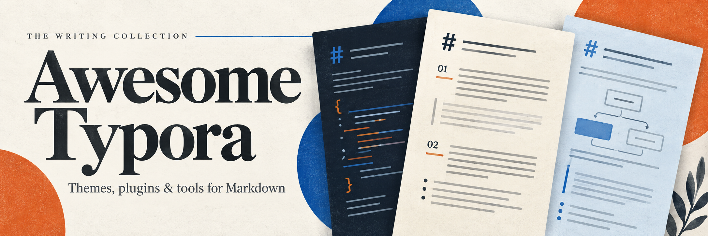

  

# Awesome Typora

English | [简体中文](README.zh-CN.md)

Themes, plugins, templates and tools for Typora, with theme previews.

For more Markdown editors, writing tools and publishing resources, see [Awesome Markdown](https://github.com/mansucache/awesome-markdown).

[Themes](#themes) · [Plugins](#plugins) · [Templates](#templates) · [Image uploaders](#image-uploaders) · [Export and diagrams](#export-and-diagrams) · [Learning resources](#learning-resources) · [Contributing](#contributing)

[Star counts and maintenance records](docs/resource-review.en.md).

## Themes

Browse the previews, then open a project's page for installation instructions. Click an image to view it at full size.

| Theme | Description | Preview |
| --- | --- | :---: |
| [LaTeX](https://github.com/Keldos-Li/typora-latex-theme) | LaTeX-style typography for Chinese documents and coursework. |  |
| [DrakeTyporaTheme](https://github.com/liangjingkanji/DrakeTyporaTheme) | A collection of color schemes for different writing preferences. |  |
| [Mdmdt](https://github.com/cayxc/Mdmdt) | Minimal document styling with light and dark variants. |  |
| [Notion for Typora](https://github.com/adrian-fuertes/typora-notion-theme) | Document styling inspired by Notion. |  |
| [typora-theme-orange-heart](https://github.com/evgo2017/typora-theme-orange-heart) | Adapted from the Orange Heart theme in markdown-nice. |  |
| [Blackout](https://github.com/obscurefreeman/typora_theme_blackout) | A dark theme. |  |
| [Spring](https://github.com/SprInec/typora-spring-theme) | A light, uncluttered document theme. |  |
| [Lapis](https://github.com/YiNNx/typora-theme-lapis) | A blue-accented theme. |  |
| [Ladder](https://github.com/guangzhengli/typora-ladder-theme) | Tailwind-style layout with LXGW Chinese fonts. |  |
| [Tailwind](https://github.com/andredelft/typora-tailwind-theme) | A layout based on Tailwind Typography. |  |
| [typora-vue-theme](https://github.com/blinkfox/typora-vue-theme) | A reading layout inspired by Vue documentation. |  |
| [typora-blubook-themes](https://github.com/HanryYu/typora-blubook-theme/tree/master) | A lightweight theme for reading and writing. |  |
| [Phycat](https://github.com/sumruler/typora-theme-phycat) | Color accents that distinguish document sections and heading levels. |  |
| [Claude-like](https://github.com/Muyiiiii/Typora_Claude-Like_Theme) | Claude-inspired light, gray-blue and dark variants, with adjustments for Chinese typography. |  |

For Chinese academic layouts, start with LaTeX. For minimal styling, try Mdmdt or Notion; for a choice of color schemes, browse Drake. A theme can look different in the editor and in an exported PDF, so try an export before using it for a finished document.

To number headings and tables of contents, see [typora-theme-auto-numbering](https://github.com/lipengzhou/typora-theme-auto-numbering). It uses CSS and needs no plugin system. The [official numbering guide](https://support.typora.io/Auto-Numbering/) explains how to customize the styles.

## Plugins

- [Typora plugin](https://github.com/obgnail/typora_plugin) — A collection of editing features and utilities for Typora.
- [Typora Community Plugin](https://github.com/typora-community-plugin/typora-community-plugin) — A community plugin system with plugin management, a command panel and other extensions.
- [Collapsible Section](https://github.com/typora-community-plugin/typora-plugin-collapsible-section) — Fold and unfold Markdown sections. Requires Typora Community Plugin.
- [Typora Copilot](https://github.com/Snowflyt/typora-copilot) — Use GitHub Copilot and Copilot Chat in Typora.
- [VLOOK](https://github.com/MadMaxChow/VLOOK) — Themes and typesetting extensions for sharing Markdown documents as HTML.

These are third-party projects. Check each project's supported Typora versions and operating systems before installing. For connected features such as Copilot, also check account requirements and which document contents are sent to the service.

## Templates

- [typora-markdown-resume](https://github.com/CodingDocs/typora-markdown-resume) — Résumé templates for software developers; replace the example content to get started.
- [LapisCV](https://github.com/BingyanStudio/LapisCV) — Create a résumé with Markdown in Typora, VS Code or Obsidian.

Check fonts and page breaks in the exported résumé.

## Image uploaders

- [PicGo](https://github.com/Molunerfinn/PicGo) — A desktop image uploader with support for multiple hosting services and plugins. A starting point for uploading images pasted into Typora.
- [PicList](https://github.com/Kuingsmile/PicList) — Builds on PicGo with remote file management, useful for browsing and deleting uploaded images.
- [PicGo-Core](https://github.com/PicGo/PicGo-Core) — The command-line version of PicGo, which Typora can call directly. An option when you do not need a desktop interface.
- [uPic](https://github.com/gee1k/uPic) — A native macOS uploader for images and files, with drag-and-drop, clipboard and keyboard shortcuts. Updated less often; included as a native Mac option.
- [Upgit](https://github.com/pluveto/upgit) — Upload files and get direct links through Typora's custom uploader. Check whether the destination repository or storage service is public before uploading.
- [typora-plugin-bilibili](https://github.com/xlzy520/typora-plugin-bilibili) — Upload images to Bilibili and replace their links in the document. Current availability has not been confirmed.

Typora's [image upload guide](https://support.typora.io/Upload-Image/) covers PicGo, PicList, PicGo-Core and uPic. Choose an uploader, then configure your image hosting service.

## Export and diagrams

- [Pandoc](https://github.com/jgm/pandoc) — Document conversion software used by some of Typora's import and export options, including Word, EPUB and LaTeX. Follow the [official setup guide](https://support.typora.io/Install-and-Use-Pandoc/).
- [Mermaid](https://github.com/mermaid-js/mermaid) — Write flowcharts, sequence diagrams, Gantt charts and more as text. Typora includes Mermaid support; no separate plugin is needed. Available syntax depends on the bundled version. See the [diagram guide](https://support.typora.io/Draw-Diagrams-With-Markdown/).

## Learning resources

- [Official theme gallery](https://theme.typora.io/) — Browse more themes by thumbnail or submit your own.
- [Typora documentation](https://support.typora.io/) — Guides to editing, themes, images and export.
- [《了不起的 Markdown》](https://book.douban.com/subject/37478156/) — A Chinese-language book about Markdown syntax, tools and writing applications. The link opens the book's listing page.

## Contributing

Have a favorite theme or a useful plugin? Share it in [Issues](https://github.com/mansucache/awesome-typora/issues) or open a pull request. Include the project link and why you recommend it; a theme preview is helpful. See the [contribution guide](CONTRIBUTING.md#english), and update both language editions when adding or removing resources.

Broken links and corrections are welcome too. This list has not been installation-tested item by item; report problems with a specific plugin to its own project.

[Maintenance guide and checks](docs/maintenance.md#english).

## License

This list is available under the [MIT License](LICENSE). Listed projects, fonts and images remain subject to their authors' licenses and copyrights.
